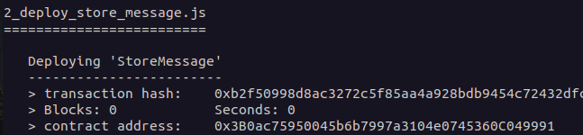

# Svelte dApp project
This is a simple **decentralised application** (**dApp**) built using Svelte JS, Truffle, and Ethers JS. To run the application make sure you have the NodeJS and NPM installed.

If you don’t have truffle installed, run the below:

    npm i -g truffle

You will also need `ganache` to run the local development node. If you don’t have `ganache` installed, run:

    npm i -g ganache
## Running the application

To run the application, you need to set up the local development node, deploy the smart contract, and launch the svelte project.

To start up the local development node, run:

    ganache

To deploy the smart contracts, open the `svelte-dapp` project in another terminal and run the below:

    truffle migrate

Copy the address of the contract in the output of `truffle migrate`:

> **Note:** make sure that the address you copy is for the `StoreMessage` contract.

Before running the svelte project, open the `dapp-frontend/src/contractData.js` file, and change the value of `address` to the address that you copied. Then, open the `dapp-frontend` folder in the terminal and run the following to start up the svelte app:

    npm run dev

